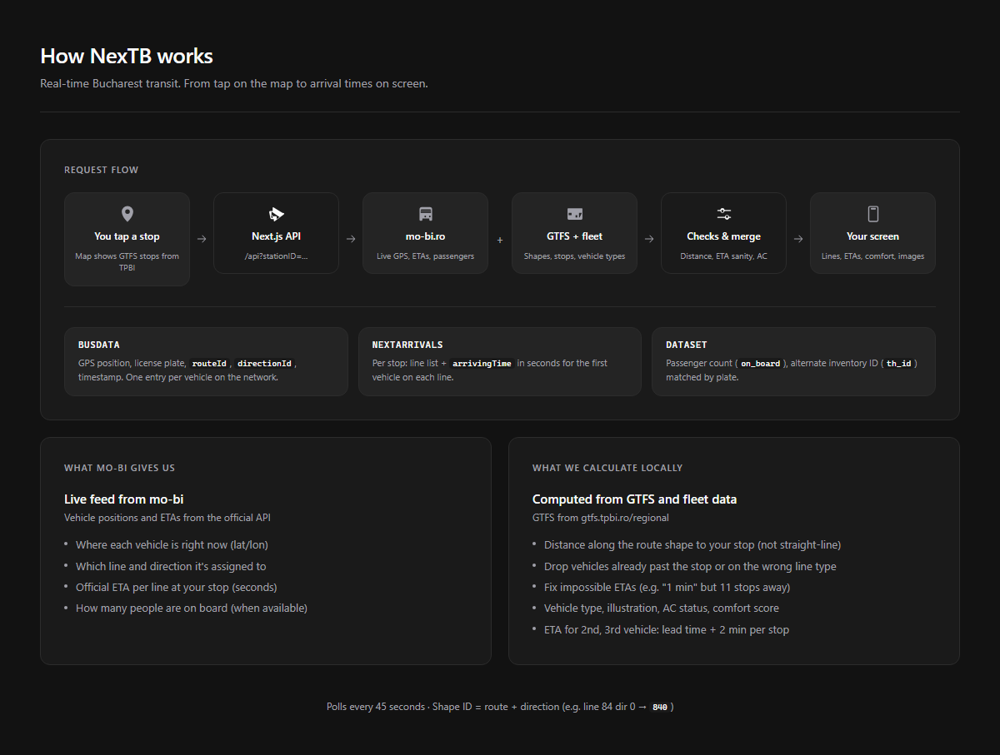

# NexTB

NexTB is a Next.js PWA for real-time Bucharest transit (STB trams, buses, and trolleybuses). It shows when vehicles are arriving at a stop, which vehicle it is (inventory ID, plate, illustration), how crowded it is, and whether the AC is likely working.

The **frontend** (this repo) is a client-only PWA, typically deployed to a static/edge host. The **API** lives in [`backend/`](backend/) — a standalone Fastify service you run on your own infrastructure. Set `NEXT_PUBLIC_API_URL` to point the app at your API base URL.

---

## What you get on screen

- **Map** - GTFS stops from TPBI, clustered. Tap a stop for live arrivals.
- **Lines** - Pick a route and see vehicles moving along the shape on a map (Tour / Retour).
- **Faulty A/C** - Report broken AC; community votes update confidence over time.
- **Alerts** - Service notifications from STB (`info.stbsa.ro`).
- **Vehicle lookup** - Search by inventory ID or license plate.
- **Fleet stats** - Breakdown of vehicle types in the STB fleet.

Each arrival row can show: ETA, vehicle image, inventory ID, plate, passenger count, AC status, comfort tier, and estimated stops away.

---

## How it works

When you tap a stop, the app calls `GET /api?stationID=…` every **45 seconds**. The server pulls live data from **mo-bi.ro**, combines it with **GTFS** files and local fleet registries, runs sanity checks, and sends back JSON the UI renders.



### The app (frontend)

The PWA loads stop locations from the API (`GET /api/getstops`). The map is MapLibre; favorites and settings live in the browser (Zustand + localStorage). When you select a stop, `StationPanel` polls the API via SWR.

### The API (backend logic)

All of this runs in [`lib/server/`](lib/server/) and is served by the [`backend/`](backend/) API service.

#### Step 1: Ask mo-bi what is happening at your stop

The server calls three endpoints in parallel (12 s server-side cache, 15 s timeout):

| Endpoint | URL (default) | What we read from it |
|----------|---------------|----------------------|
| **busData** | `https://maps.mo-bi.ro/api/busData` | Live GPS for every vehicle: `vehicle.trip.routeId`, `vehicle.trip.directionId`, `vehicle.vehicle.licensePlate`, `vehicle.vehicle.th_id`, `vehicle.position.latitude/longitude`, `vehicle.timestamp` |
| **nextArrivals** | `https://maps.mo-bi.ro/api/nextArrivals/{stopId}` | Stop `name`, `address`, and `lines[]` with `id`, `name`, `direction`, and **`arrivingTime`** (seconds until the first vehicle on that line) |
| **dataset** | `https://maps.mo-bi.ro/api/dataset` | `passenger_info.on_board`, alternate `th_id`, matched to busData by normalized plate (`B-423-STB` → `B423STB`) |

`arrivingTime` is converted to minutes with `Math.ceil(seconds / 60)`. If mo-bi does not send a time, the lead vehicle is marked with the internal sentinel `"m"`, shown on screen as **17+ min** via i18n.

For each line at the stop, we filter `busData` to vehicles where `routeId` and `directionId` match that line.

#### Step 2: Load GTFS context

GTFS is downloaded from [gtfs.tpbi.ro/regional](https://gtfs.tpbi.ro/regional/BUCHAREST-REGION.zip) on first run (and refreshed daily via cron in production). Files land in `data/`:

| File | Used for |
|------|----------|
| `stops.txt` | Stop coordinates (`stop_lat`, `stop_lon`) for distance math |
| `routes.txt` | Line mode: tram (`route_type` 0), trolleybus (11), bus (everything else) |
| `shapes.txt` | Route polylines. **Shape ID = route ID + direction**, e.g. line 84 direction 0 → `840`, direction 1 → `841` |

Parsed stops are written to `assets/data/stops.json` during `npm run gtfs:prepare`.

#### Step 3: Calculate position along the route

Mo-bi gives you a GPS dot. That dot might be wrong if the feed glitches. We project the vehicle and the stop onto the GTFS shape polyline (Turf.js `nearestPointOnLine`) and measure **distance along the line**, not straight-line distance.

From that we:

- Sort vehicles closest-first
- Drop vehicles already **past** the stop
- Drop vehicles more than **500 m** off the shape (station view) or **10 m** off the shape (route map view)
- Estimate **stops away**: `round(distance / 350 m)`, minimum 1

If any vehicle on a line has a stale timestamp (older than `LINE_CHECK_COOLDOWN`), the server waits 5 seconds and refetches `busData` once.

#### Step 4: Resolve vehicle identity and type

Mo-bi sometimes sends `th_id: 0` or the wrong inventory ID for a plate. The server merges `busData` + `dataset`, then resolves each vehicle through the fleet registry (see [Fleet data](#fleet-data) below).

We also check **vehicle mode vs line mode**. A tram reported on a bus line gets dropped. If `th_id` conflicts with the plate, we prefer the plate lookup.

#### Step 5: Fix bad ETAs and fill in follower times

Mo-bi's `arrivingTime` is the official ETA for the **first** vehicle on a line. It is often wrong (e.g. **1 min** while the closest bus is 11 stops away).

For the lead vehicle we compute a **minimum plausible ETA** from:

- **Speed model**: distance ÷ average speed (tram ~250 m/min, bus/trolley ~220 m/min)
- **Stop model**: 1 min for the first stop segment, then +2 min per extra stop

We take the higher of the two. If mo-bi's ETA is below that (minus 1 min tolerance), we replace it.

Vehicles behind the leader do not get their own mo-bi ETA. We use: **lead ETA + 2 min × extra stops**.

#### Step 6: AC status and comfort score

**AC confidence** comes from community reports (Neon Postgres when `DATABASE_URL` is set; in-memory locally), seeded from `data/noAC.json`:

- ≥5 "broken" votes → `broken`
- ≥1 vote → `uncertain`
- Otherwise type defaults (some tram/bus families never had AC)

**Comfort score** (`lib/comfort/score.ts`):

```
comfort = AC points × 0.6 + crowd points × 0.4
```

Crowd uses `on_board` from dataset: under 25 passengers → great, under 45 → ok, else poor. Tiers: **great** (≥0.75), **ok** (≥0.45), **poor** below that.

#### What goes back to the client

```json
{
  "name": "Piata Unirii",
  "address": "...",
  "lines": {
    "84": [
      {
        "id": 4661,
        "plate": "B-116-XIS",
        "time": 4,
        "distance": 1200,
        "stopsAway": 3,
        "on_board": 31,
        "type": "Mercedes-Benz Citaro",
        "image": "/vehicles/4661.png",
        "ac": true,
        "acConfidence": "ok",
        "comfortScore": 0.72,
        "comfortTier": "ok"
      }
    ]
  }
}
```

Lines are keyed by short name (`"84"`, `"5"`, …).

---

## Map stop filtering (`bad-stops.json`)

GTFS from TPBI includes entries that are not real passenger stops: elevator shafts, stairwells, internal station nodes, and similar points that still have numeric `stop_id` values inside Bucharest.

Before anything reaches the map or search, stops go through automatic filters in `lib/stops/search-index.ts`:

- numeric `stop_id` only
- coordinates inside the Bucharest bounding box
- `location_type` empty, `0`, or `1` (stop or station)
- no `parent_station` set

Some bad entries still pass those rules. `data/bad-stops.json` is a manual blocklist: a JSON array of `stop_id` integers to hide from the map and station search.

It is loaded in `lib/server/gtfs.ts` when building `getStopsJson()` and when building the search index. If the file is missing or empty, nothing is blocklisted.

To contribute a fix: find the `stop_id` in GTFS (`data/stops.txt` or `assets/data/stops.json`), confirm the marker is not a platform, and add the ID to `bad-stops.json`.

---

## Fleet data

STB vehicle illustrations and metadata live in the repo. Regional operators (STCM, STV, etc.) are not covered yet.

### File layout

| File | Role |
|------|------|
| `lib/vehicles/fleet/lookup.json` | Master registry keyed by inventory ID (`"4661"` → record). Used by `getFleetInfo()` and vehicle search (`GET /api/vehicle/search`). |
| `lib/vehicles/fleet/meta.json` | Sources and field lists per family (counts, where the data came from). |
| `lib/vehicles/fleet/otokar.json` | Otokar Kent buses: inventory, plate, VIN, depot. |
| `lib/vehicles/fleet/citaro.json` | Mercedes Citaro: inventory, plate, depot, km, AC retrofit notes in `details`. |
| `lib/vehicles/fleet/city-tour.json` | Bucharest City Tour buses. |
| `lib/vehicles/fleet/trolleybus.json` | STB trolleybus fleet with manufacturer, `modelType`, year, depot. |
| `lib/vehicles/fleet/all-buses.json` | Remaining STB bus types not in dedicated family files. |
| `lib/vehicles/fleet/tram.json` | STB tram fleet. |
| `lib/vehicles/fleet/tram-by-inventory.json` | Tram records indexed by inventory ID. |
| `lib/vehicles/fleet/tram-by-plate.json` | Tram records indexed by plate (used when mo-bi only sends a plate). |
| `lib/vehicles/fleet/trolleybus-by-plate.json` | Trolleybus plate index. |
| `lib/vehicles/imageMap.ts` | Inventory ID ranges and model names → PNG filename for STB vehicles. |
| `public/vehicles/` | Illustration assets referenced by `imageMap.ts`. |
| `lib/stats/stats.json` | Fleet and network numbers for the landing and fleet pages. Maintained manually; not regenerated on build. |

`lookup.json` is the runtime index. The per-family JSON files are the editable source data. When you add a vehicle, update the relevant family file and add the same record to `lookup.json` keyed by inventory ID string (e.g. `"4661"`).

### How a vehicle gets resolved

When a live vehicle arrives from mo-bi, `lib/server/resolve-vehicle.ts` and `lib/vehicles/fleetInfo.ts` run this chain:

1. **Normalize the plate** (`B-423-STB` → `B423STB`) and join `busData` with `dataset` for passenger count and alternate `th_id`.
2. **Look up by plate first** in `tram-by-plate.json`, `trolleybus-by-plate.json`, then `lookup.json`.
3. **Fall back to inventory ID** in `tram-by-inventory.json` and `lookup.json`.
4. **Pick model name and image** from the fleet record's `modelType`, or from `imageMap.ts` inventory ranges (e.g. `6400-6720` → Otokar Kent 12m).
5. **Check mode** (tram / bus / trolleybus) against the GTFS line type. Mismatches are dropped from arrivals.

Each fleet record has a `family` field (`bus`, `tram`, `trolleybus`, `otokar`, `citaro`, `cityTour`) that drives mode detection and which fields are shown on the vehicle detail page.

### STB vs regional operators

The app currently has full fleet coverage and illustrations for **STB** vehicles. Regional TPBI operators (STCM, STV, and others) appear in GTFS with different `agency_id` values and can be toggled in settings, but they have no fleet JSON entries and no vehicle images yet. Those are the main open data gaps.

---

## Known issues

Some of these are data problems, not app bugs:

- **Missing vehicle IDs / placeholder images** - TPBI sometimes returns `th_id: 0`. We fall back to plate lookup when we can; otherwise you get a generic image.
- **Wrong map markers** - GTFS includes non-platform nodes that pass automatic filters. Add their `stop_id` to `bad-stops.json` (see above).
- **Vehicles missing at route ends** - Some stops only track one direction in mo-bi's line list. What you see depends on how that stop is configured in the feed.
- **Implausible ETAs** - We correct many of them, but mo-bi remains the source for the lead vehicle when it passes sanity checks.
- **Regional operators** - Lines work, but vehicle type and images are missing without fleet data for STCM/STV/etc.

---

## Run it locally

```bash
cp .env.example .env.local
npm install
npm run dev
```

Open [http://localhost:3000](http://localhost:3000). For full functionality, run the API locally — see [`backend/README.md`](backend/README.md).

Production build:

```bash
npm run build
npm start
```

**Frontend:** deploy to your static/edge host (see [`DEPLOYMENT.md`](DEPLOYMENT.md)).  
**API:** deploy [`backend/`](backend/) separately (Docker recommended).

### Environment variables

Copy from [`.env.example`](.env.example). The frontend mainly needs:

| Variable | Purpose |
|----------|---------|
| `NEXT_PUBLIC_API_URL` | Base URL of the NexTB API (no trailing slash) |

Backend secrets (`DATABASE_URL`, `CRON_SECRET`, mo-bi URLs, etc.) belong in `backend/.env` — see [`backend/.env.example`](backend/.env.example).

### Tests

```bash
npm run test:unit     # Vitest
npm run test:e2e      # Playwright smoke test
npm run test:ci       # full CI pipeline locally
```

Manual checklist: [`TESTING.md`](TESTING.md). Migrations: [`tests/db/migrations/`](tests/db/migrations/).

### Tech stack

- Next.js 16 App Router, TypeScript, Tailwind CSS 4 (frontend)
- Fastify API in `backend/` (see [`backend/README.md`](backend/README.md))
- MapLibre GL + react-map-gl + supercluster
- Zustand, SWR, Vaul, Framer Motion
- @serwist/next PWA

See [`DEPLOYMENT.md`](DEPLOYMENT.md) for production setup.

---

## Contributions

Contributions are welcome: code, fleet data, GTFS cleanup, and regional operator support. If you are not sure where to start, pick something from the plan below or [reach out](mailto:cristian@koders.ro).

### Contribution plan

| Priority | Area | Task | Where to look |
|----------|------|------|---------------|
| P0 | Data | Add `stop_id` values to `bad-stops.json` for non-platform GTFS markers | `data/bad-stops.json` |
| P0 | Fleet | Fill missing STB inventory IDs, plates, and model types | `lib/vehicles/fleet/*.json`, [metrouusor.com](https://www.metrouusor.com/), [transport-in-comun.ro](https://transport-in-comun.ro/bucuresti/) |
| P1 | Agencies | STCM, STV, and other TPBI regional operators: fleet JSON, vehicle images, `imageMap.ts` entries | `lib/routes/agency.ts`, `lib/vehicles/fleet/`, `public/vehicles/` |
| P1 | AC data | Verify or extend `noAC.json` / AC vote thresholds | `data/noAC.json`, `lib/server/ac-votes.ts` |
| P2 | Quality | Tune ETA sanity defaults with real-world examples | `lib/server/data-quality.ts`, env vars |
| P2 | Tests | Unit tests for edge cases you hit in production | `tests/unit/**/*.test.ts` |
| P3 | Features | Vehicle detail page (mileage, VIN, photos from public sources) | new route under `app/app/` |

### Good first issues

1. **GTFS stop cleanup** - Find a map marker that is clearly not a platform and add its `stop_id` to `bad-stops.json`.
2. **Plate / ID mapping** - When you ride an STB vehicle and know its inventory ID, add or fix an entry in the relevant fleet JSON file.
3. **Regional lines** - Test a STCM or STV line, note what breaks (wrong mode, missing image), open a PR with fleet data and illustrations for that operator.
4. **Citaro AC notes** - Some Euro 3 Citaro units were retrofitted; `details` in `citaro.json` drives per-vehicle AC capability.

### Before you open a PR

```bash
npm run lint
npm run test
```

Keep PRs focused. One fleet file, one operator, or one logic fix per PR is easier to review.

---

## Project layout

```
├── app/             # Pages + API routes
├── components/      # UI
├── lib/server/      # Arrivals, mo-bi, GTFS, data quality
├── lib/vehicles/    # Fleet data + image map
├── tests/           # Unit tests, e2e smoke test, DB migrations
├── data/            # GTFS txt, noAC, bad-stops
├── docs/            # Readme diagram image
└── public/vehicles/ # STB vehicle illustrations
```

---

## Credits

- [metrouusor.com](https://www.metrouusor.com/) - public vehicle type lists by inventory ID
- [transport-in-comun.ro](https://transport-in-comun.ro/bucuresti/) - STB fleet exports
- [TPBI](https://tpbi.ro/) and [mo-bi](https://mo-bi.ro/) - GTFS and live APIs
- Alexandru Mihai Nenciu - Bucharest logo